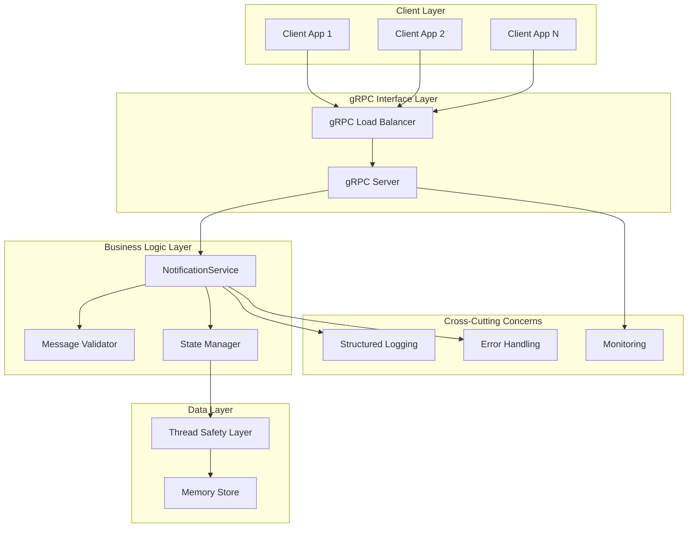
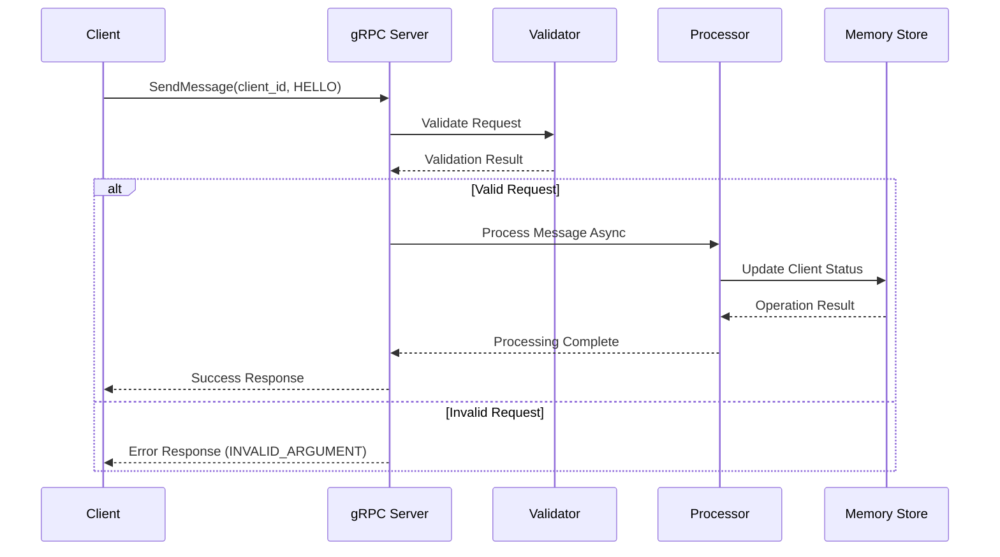
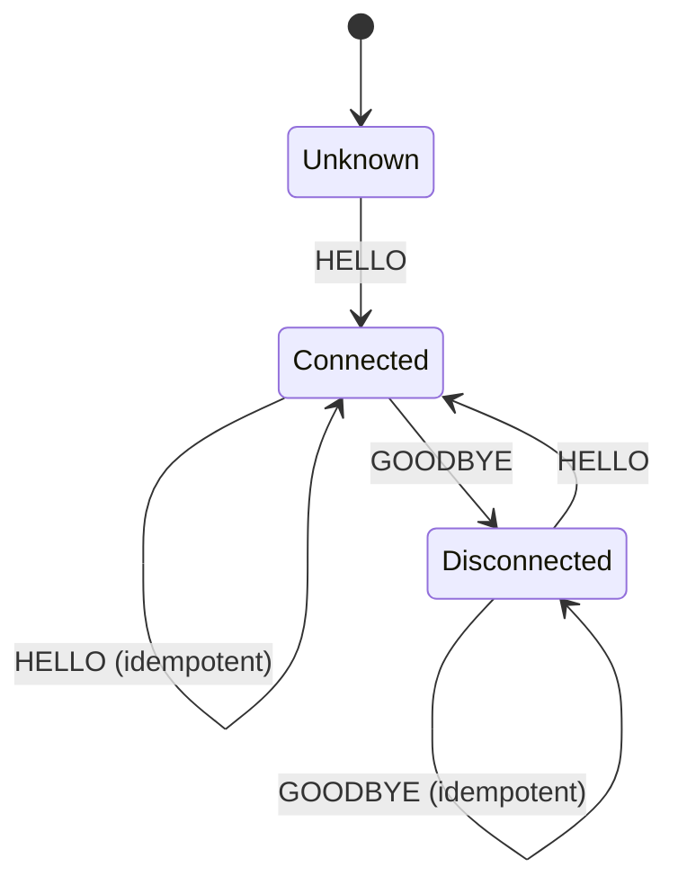

# System Architecture Documentation

## 🏗️ Architecture Overview

The Asynchronous User Notification System is built using a **microservices-oriented architecture** with **event-driven patterns** and **clean separation of concerns**. The system leverages modern async Python capabilities to deliver high-performance, scalable client connection management.

## 📐 High-Level Architecture



## 🔄 Component Architecture

### 1. **Presentation Layer** - gRPC Interface
```python
# Proto-first design with versioned contracts
service NotificationService {
  rpc SendMessage(SendMessageRequest) returns (SendMessageResponse);
  rpc GetClientStatus(GetClientStatusRequest) returns (GetClientStatusResponse);
}
```

**Responsibilities:**
- Protocol buffer message validation
- gRPC error code mapping
- Request/response serialization
- Connection lifecycle management

### 2. **Business Logic Layer** - Service Implementation
```python
class NotificationServiceImpl(NotificationServiceServicer):
    """
    Core business logic with async processing and state management
    """
    
    async def SendMessage(self, request, context):
        # Input validation
        # Async message processing  
        # State transition management
        # Error handling & logging
    
    async def GetClientStatus(self, request, context):
        # Query processing
        # Result filtering
        # Response formatting
```

**Key Design Patterns:**
- **Command Pattern**: Message processing commands
- **State Pattern**: Client connection state management
- **Facade Pattern**: Simplified interface to complex subsystems
- **Observer Pattern**: Async event handling

### 3. **Data Access Layer** - Thread-Safe Storage
```python
class ThreadSafeStorage:
    """
    Thread-safe in-memory storage with RLock protection
    """
    
    def __init__(self):
        self._client_statuses: Dict[str, str] = {}
        self._lock = threading.RLock()
    
    def update_status(self, client_id: str, status: str):
        with self._lock:
            self._client_statuses[client_id] = status
```

**Design Principles:**
- **ACID Properties**: Atomic operations with proper locking
- **Isolation**: Thread-safe concurrent access
- **Consistency**: State validation on all operations

## 🧩 Detailed Component Design

### gRPC Server Architecture

```python
# Async server with thread pool execution
async def serve(port: int = 50051) -> None:
    server = aio.server(ThreadPoolExecutor(max_workers=10))
    
    # Service registration
    service_impl = NotificationServiceImpl()
    add_NotificationServiceServicer_to_server(service_impl, server)
    
    # Non-blocking server lifecycle
    await server.start()
    await server.wait_for_termination()
```

**Key Features:**
- **Async I/O**: Non-blocking request processing
- **Thread Pool**: Concurrent request handling
- **Graceful Shutdown**: Clean resource cleanup
- **Error Recovery**: Robust error handling

### Message Processing Pipeline



### State Management Architecture

```python
class ClientStateManager:
    """
    Manages client connection state transitions
    """
    
    VALID_TRANSITIONS = {
        ('unknown', 'connected'),
        ('connected', 'disconnected'),
        ('disconnected', 'connected'),
    }
    
    async def transition_state(self, client_id: str, new_state: str):
        # State validation
        # Atomic state update
        # Event notification
        # Audit logging
```

**State Diagram:**


## 🔒 Security Architecture

### Authentication & Authorization
```python
class SecurityInterceptor(grpc.aio.ServerInterceptor):
    """
    Authentication and authorization interceptor
    """
    
    async def intercept_service(self, continuation, handler_call_details):
        # Extract auth metadata
        # Validate credentials
        # Check permissions
        # Pass context to handlers
```

### Input Validation
```python
class MessageValidator:
    """
    Comprehensive input validation
    """
    
    @staticmethod
    def validate_client_id(client_id: str) -> bool:
        # Non-empty validation
        # Length constraints
        # Character set validation
        # Injection attack prevention
    
    @staticmethod  
    def validate_message_type(msg_type: MessageType) -> bool:
        # Enum validation
        # Range checking
        # Type safety
```

## 📊 Data Architecture

### In-Memory Storage Design
```python
# Thread-safe data structures
_client_statuses: Dict[str, str] = {
    "client_1": "connected",
    "client_2": "disconnected", 
    "client_3": "connected"
}

# Access patterns
- Read: O(1) lookup by client_id
- Write: O(1) status update
- Query: O(n) for all clients filter
```

### Scalability Considerations
```python
# Horizontal scaling with external storage
class DatabaseStorage:
    """
    Persistent storage implementation
    """
    
    async def get_client_status(self, client_id: str) -> Optional[str]:
        # Database query with connection pooling
        # Caching layer integration
        # Read replica optimization
    
    async def update_client_status(self, client_id: str, status: str):
        # ACID transaction
        # Write-through caching
        # Event sourcing
```

## 🔄 Concurrency Architecture

### Async Processing Model
```python
# Event loop with async/await
async def _process_message_async(self, client_id: str, message_type: MessageType):
    # Simulated async I/O
    await asyncio.sleep(0.01)
    
    # Thread-safe state update
    with self._lock:
        self._client_statuses[client_id] = new_status
```

### Thread Safety Patterns
```python
# RLock for reentrant operations
self._lock = threading.RLock()

# Context manager pattern
with self._lock:
    # Critical section
    # Atomic operations
    # Consistent state
```

## 🧪 Testing Architecture

### Test Pyramid Structure
```
    /\
   /  \     E2E Tests (1-2)
  /____\    Integration Tests (2-3)  
 /      \   Unit Tests (7+)
/__________\
```

### Test Categories

**1. Unit Tests**
```python
@pytest.mark.asyncio
async def test_send_hello_message(service):
    # Given: Fresh service instance
    # When: Send Hello message
    # Then: Client marked as connected
```

**2. Integration Tests**
```python
@pytest.mark.asyncio
async def test_complete_workflow():
    # Given: Real service components
    # When: Execute end-to-end workflow
    # Then: Verify state consistency
```

**3. Load Tests**
```python
async def test_concurrent_clients():
    # Given: Multiple concurrent clients
    # When: Simultaneous operations
    # Then: Thread safety maintained
```

## 📈 Performance Architecture

### Async I/O Optimization
- **Non-blocking Operations**: All I/O operations use async/await
- **Connection Pooling**: gRPC connection reuse
- **Request Batching**: Multiple operations per connection
- **Memory Management**: Efficient data structures

### Scalability Patterns
```python
# Horizontal scaling
class LoadBalancer:
    def route_request(self, request):
        # Round-robin distribution
        # Health check integration
        # Circuit breaker pattern
        
# Vertical scaling  
class ThreadPoolManager:
    def __init__(self, max_workers: int = 10):
        # CPU-based worker allocation
        # Dynamic thread adjustment
        # Resource monitoring
```

## 🔍 Monitoring Architecture

### Observability Stack
```python
# Structured logging
logger = logging.getLogger(__name__)
logger.info("Client {client_id} connected", extra={
    "client_id": client_id,
    "timestamp": datetime.utcnow(),
    "operation": "connect"
})

# Metrics collection
from prometheus_client import Counter, Histogram

message_counter = Counter('messages_total', 'Total messages processed')
request_duration = Histogram('request_duration_seconds', 'Request duration')
```

### Health Checks
```python
class HealthService:
    async def check_health(self):
        # Service availability
        # Dependency health
        # Resource utilization
        # Performance metrics
```

## 🔄 Deployment Architecture

### Container Strategy
```dockerfile
# Multi-stage build
FROM python:3.11-slim as builder
WORKDIR /app
COPY requirements.txt .
RUN pip install --user -r requirements.txt

FROM python:3.11-slim
WORKDIR /app
COPY --from=builder /root/.local /root/.local
COPY src/ ./src/
EXPOSE 50051
CMD ["python", "src/server.py"]
```

### Kubernetes Deployment
```yaml
# High availability deployment
apiVersion: apps/v1
kind: Deployment
metadata:
  name: notification-service
spec:
  replicas: 3
  strategy:
    type: RollingUpdate
  template:
    spec:
      containers:
      - name: notification-service
        image: notification-service:latest
        ports:
        - containerPort: 50051
        resources:
          requests:
            memory: "64Mi"
            cpu: "250m"
          limits:
            memory: "128Mi" 
            cpu: "500m"
```

## 🔮 Future Architecture Evolution

### Microservices Decomposition
```
Current Monolith → Future Microservices

┌─────────────────┐    ┌──────────────┐
│   Notification  │    │  Auth Service│
│    Service      │ -> │              │
│                 │    └──────────────┘
│  - Auth         │    ┌──────────────┐
│  - Messaging    │    │Message Service│
│  - State Mgmt   │    │              │
└─────────────────┘    └──────────────┘
                       ┌──────────────┐
                       │ State Service│
                       │              │
                       └──────────────┘
```

### Event-Driven Architecture
```python
# Event sourcing implementation
class EventStore:
    async def append_event(self, stream_id: str, event: Event):
        # Immutable event log
        # Event replay capability
        # CQRS pattern support
        
class EventHandler:
    async def handle_client_connected(self, event: ClientConnected):
        # Update read models
        # Trigger notifications
        # Audit logging
```

This architecture provides a solid foundation for a production-ready, scalable notification system while maintaining clean code principles and comprehensive testing strategies.